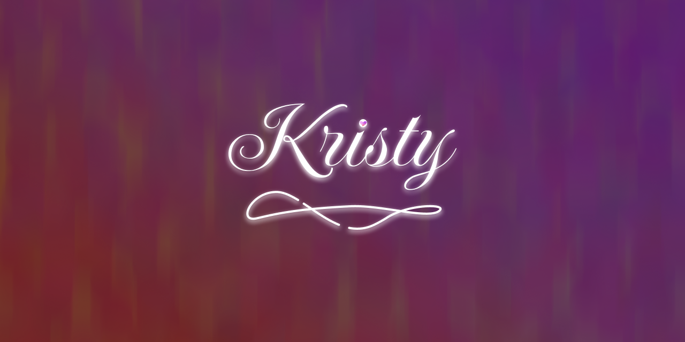

# kristy (KristyType)

Кристи создана для веселья и утешения — ваша подруга в информационной оболочки. Основными функциями её деятельности является запоминание идей, контролирование поведения и немного другие странности.

## Предыстория (с идеей)

Изначально бот был создан из-за любопытства к фреймворку [discord.js](https://discord.js.org/) и языку программирования [TypeScript](https://www.typescriptlang.org/), на котором я начинал писать в тот момент. В нём не было ярой необходимости — только fun и желание попробовать две эти технологии.

## Цель проекта

1. Сейчас моей задачей будет рефакторинг кода, чтобы его можно было легко понять и разобрать, а не так, как вышло до версий 2.0.7.
2. Реализовать тот функционал, что есть в холсте
3. Интегрировать backend с базой данных
4. Написать панель управления ботом с удобным UI/UX
5. Интегрировать мои второстепенные пакеты *(просто хочу)*, развивая их и использую в production

Все свои планы я оставлю в этом репозитории внутри файла с холстом *(открывать через [Obsidian](https://obsidian.md/))*.

## Документация

- [Русский](./docs/ru/README.md)

## Связанные проекты

> [!HINT]
>
> Указаны только мои

- [lanvalird/krasliviy](https://github.com/lanvalird/krasliviy)
