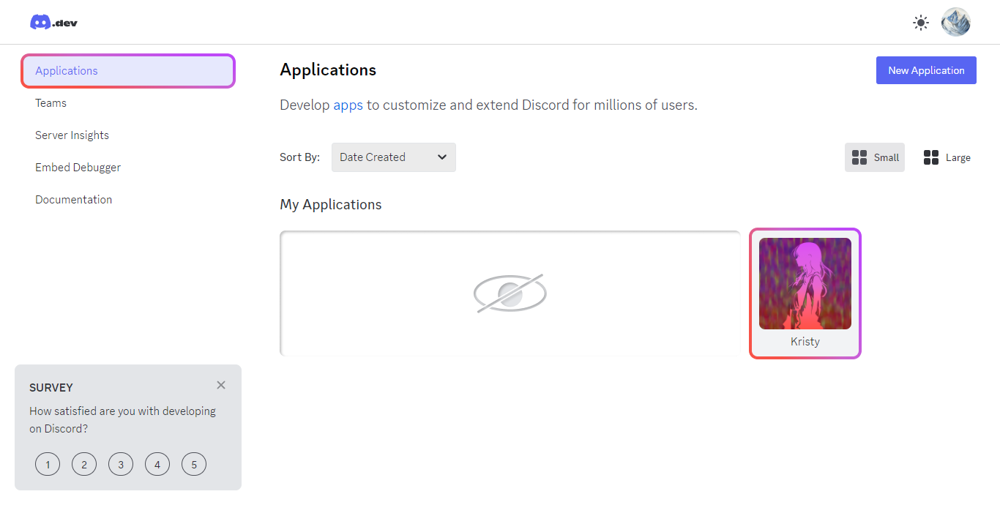
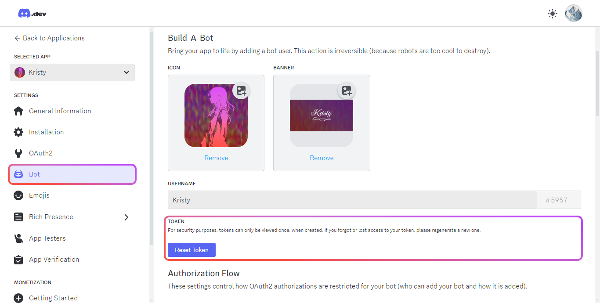

# Установка (б/у)

## 1. Зависимости

```bash
# Вот так в терминал и пишем :)
pnpm install
```

### 2. Окружение

Выполните следующую команду в терминале:

```bash
cp .env.example .env
```

После её выполнения откройте файл `.env` и заполните поле "BOT_TOKEN".

Токен бота можно отыскать на [портале разработчика Discord](https://discord.com/developers/applications/) в профиле приложения во вкладке "BOT".

### Как это сделать?

**Шаг 1.** Откройте портал разработчика Discord, после чего перейдите во кладку Apllications, и нажав на карточку желаемого бота. Если такой нет — используйте кнопку «New Application» для создания нового бота.



**Шаг 2.** Перейдите в раздел «Bot» и скопируйте текущий токен, либо сбросьте его.



**Шаг 3.** Вставьте этот токен в `.env` файл:

```conf
BOT_TOKEN="MY_TOKEN_SHOULD_PLACED_HERE"
```

### 3. Запуск бота

Используйте в терминале команду:

```bash
pnpm run kristy:start
```

## Расширенная настройка

[Продолжить чтение](./advanced.md)
