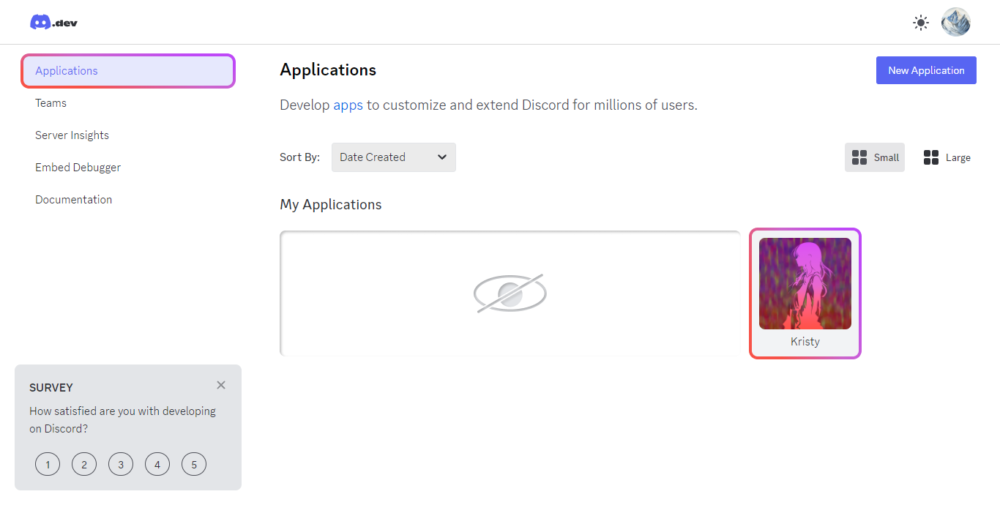
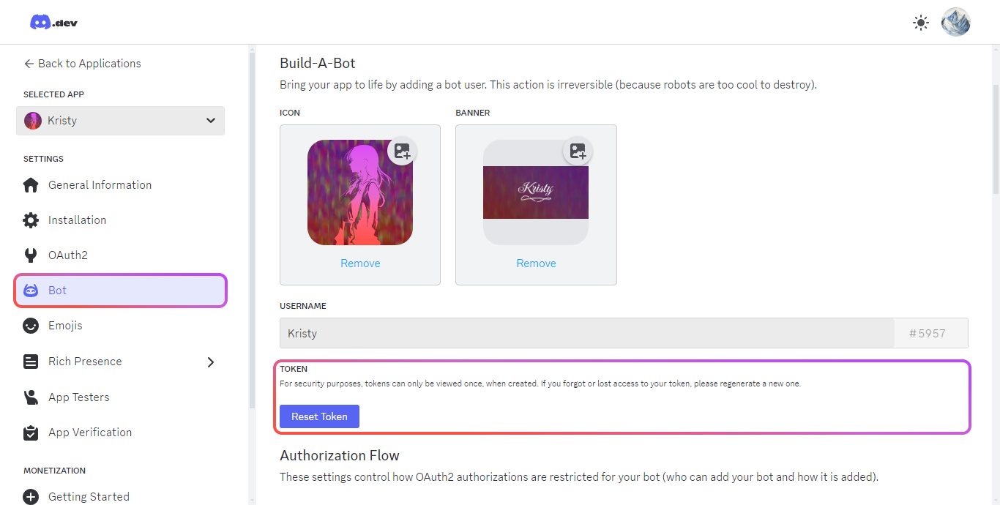

# Установка (б/у)

## 1. Зависимости

```bash
pnpm install
```

### 2. Окружение

```bash
cp .env.example .env
```

После выполнения команды в терминале, откройте файл `.env` и заполните поле "BOT_TOKEN".

Токен бота можно отыскать на [портале разработчика Discord](https://discord.com/developers/applications/) в профиле приложения во вкладке "BOT".

<table>
  <td width="50%">
    
  </td>
  <td width="50%">
    
  </td>
</table>

### 3. Запуск бота

```bash
pnpm kristy:start
```

## Расширенная настройка

[Продолжить чтение](./advanced.md)
